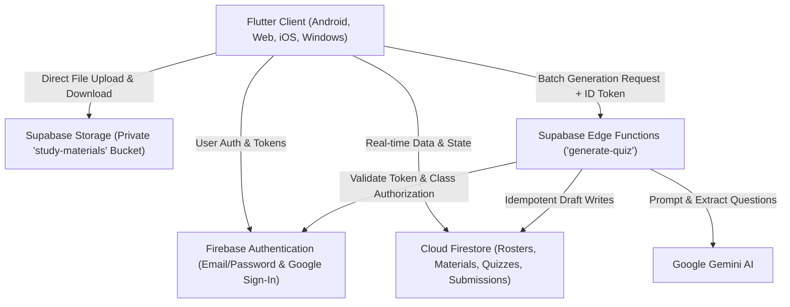

<p align="center">
  
</p>

<h1 align="center">Studexa</h1>

<p align="center">
  <strong>Intelligent Classroom Assessment & Study Material Platform</strong>
</p>

<p align="center">
  
  
  
  
  
  
</p>

---

## 📖 Overview

**Studexa** is an academic companion designed for educators and students. It bridges course study materials and rigorous student assessment by providing automated, context-grounded quiz generation, interactive in-app study document viewing, and deterministic scoring.

Teachers can upload course lecture materials (PDF, PPTX, DOCX), automatically generate comprehensive assessments across five pedagogical question types using Google Gemini AI, review and edit questions, publish practice quizzes, or print formal A4 exam sheets. Students can enroll in classes using unique join codes, access course materials directly in-app, take formative practice quizzes with instant feedback, and track their academic progress.

---

## ✨ Key Features

### 👨‍🏫 Teacher Experience
- **Classroom Management**: Create and manage classes, generate unique student enrollment join codes, and monitor roster participation.
- **Instant Material Ingestion**: Upload course presentations, documents, and syllabus files (`.pdf`, `.docx`, `.pptx`). On-device text extraction processes content instantly without blocking network uploads.
- **AI Quiz Generation**: Generate up to 50 curriculum-grounded questions in batches of 10 with deterministic question deduplication (token Jaccard similarity analysis).
- **Manual Question Authoring**: Add or edit questions manually via dedicated interactive modal dialogs across all supported question types.
- **Actual vs. Practice Modes**:
  - **Actual Quiz**: Finalized benchmark exam with master answer keys and printable A4 PDF exports for in-class testing.
  - **Practice Quiz**: Formative assessment published directly to enrolled students.
- **Live Submission Monitoring**: View class completion rates, score distributions, and individual student response breakdowns in real-time.

### 👩‍🎓 Student Experience
- **Simple Enrollment**: Join classes using quick 6-character alphanumeric class codes.
- **Unified Document Viewer**: View course materials natively within the app (`SfPdfViewer`) with an instant toggle to extracted text.
- **Interactive Quiz Taking**: Answer questions with question flags, question navigation grid, and local draft autosave to prevent answer loss.
- **Adaptive Practice**: Up to 2 attempts per practice quiz with randomized question orders on retakes and immediate score feedback.

### 📝 Pedagogical Question Formats
Studexa supports five question formats:
1. **Multiple Choice**: Single-choice questions with balanced distractors.
2. **True / False**: Conceptual verification statements.
3. **Fill in the Blank**: Sentence-level recall with standardized sentence stems.
4. **Identification**: Precise terminology recall with typo tolerance (Levenshtein distance matching).
5. **Enumeration**: Multi-item recall with partial credit scoring and automatic answer deduplication.

---

## 🏗️ Architecture & Technology Stack



- **Frontend**: [Flutter](https://flutter.dev/) (Material 3 with custom [`AppTheme`](lib/theme/app_theme.dart))
- **Authentication**: Firebase Authentication with Email/Password and native Google Sign-In
- **Database**: Cloud Firestore for real-time document synchronization and metadata persistence
- **File Storage**: [Supabase Storage](https://supabase.com/storage) with private bucket RLS policies tied to Firebase ID tokens
- **AI Processing**: [Supabase Edge Functions](https://supabase.com/edge-functions) running on Deno/TypeScript, calling Google Gemini AI with grounded prompt validation and anti-repetition filters

---

## 🚀 Getting Started

### Prerequisites
- [Flutter SDK](https://docs.flutter.dev/get-started/install) (`^3.12.2` or later)
- Android Studio / Android SDK (API 34+)
- Firebase CLI (`npm install -g firebase-tools`)
- Supabase CLI (`npx supabase`)

### Setup Instructions

1. **Clone the Repository**:
   ```bash
   git clone https://github.com/flynne09/Studexa.git
   cd Studexa
   ```

2. **Install Dependencies**:
   ```bash
   flutter pub get
   ```

3. **Configure Environment & Credentials**:
   - **Firebase**: Copy `firebase.config.example.json` to the ignored `firebase.config.json`, then replace its placeholders with the platform API keys from your Firebase app settings. Firebase client keys identify the project; protect data with Security Rules and App Check, and restrict each key to its intended Firebase APIs and application in Google Cloud Console.
   - **Supabase**: Configure your Supabase project URL and publishable key via `--dart-define` or default settings in [`lib/config/supabase_config.dart`](lib/config/supabase_config.dart).
   - **Edge Functions**: Deploy the `generate-quiz` Supabase Edge Function with your `GEMINI_API_KEY` secret as described in [`docs/SUPABASE_QUIZ_GENERATION_SETUP.md`](docs/SUPABASE_QUIZ_GENERATION_SETUP.md).

4. **Run the Application**:
   ```bash
   flutter run --dart-define-from-file=firebase.config.json
   ```

5. **Build Release APK**:
   ```bash
   flutter build apk --release --dart-define-from-file=firebase.config.json
   ```

---

## 🧪 Testing & Quality Assurance

Studexa includes an extensive automated test suite covering unit models, services, scoring algorithms, and responsive UI walkthroughs:

```bash
# Run all automated tests (198 tests)
flutter test

# Run static code analysis
flutter analyze
```

---

## 📚 Documentation Index

For technical guides and architectural specifications, refer to the `docs/` directory:
- [**Project Understanding**](docs/PROJECT_UNDERSTANDING.md) — Detailed codebase inventory, schemas, and design constraints.
- [**UI Design Walkthrough**](docs/UI_DESIGN_WALKTHROUGH.md) — Comprehensive visual design system, token usage, and responsive behavior.
- [**Supabase Storage Setup**](docs/SUPABASE_STORAGE_SETUP.md) — Storage migration, RLS policies, and setup instructions.
- [**Supabase Quiz Generation Setup**](docs/SUPABASE_QUIZ_GENERATION_SETUP.md) — Edge function deployment, secrets configuration, and verification.
- [**Network Transactions**](docs/NETWORK_TRANSACTIONS.md) — Complete endpoint, protocol, and payload specifications.
- [**Implementation Log**](docs/IMPLEMENTATION_LOG.md) — Chronological development history, audit log, and benchmarks.

---

<p align="center">
  Developed for modern classrooms and digital learning environments.
</p>
