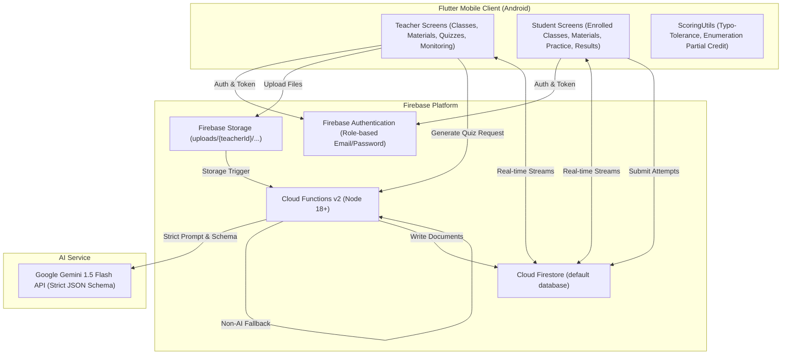

# Studexa Phase 1 Master Implementation Plan

This document details the architectural and technical implementation plans across all Phase 1 modules of Studexa.

---

## 1. System Architecture Overview



---

## 2. Completed Modules

### Phase A: Project Baseline & Foundation
- Firebase configuration (`firebase.json`, `firestore.rules`, `storage.rules`).
- Connection to Firestore database `default`.

### Phase B: Authentication & Role Routing
- `AuthService`, `UserProfile`, `LoginScreen`, `RegisterScreen`, `SplashScreen`.
- Persistent session recovery, role mismatch protection, exponential write retry.

### Phase C: Core Scoring Algorithms
- `ScoringUtils.isFreeTextMatch`: Case-insensitive, punctuation-stripped, length-tiered Levenshtein distance typo tolerance.
- `ScoringUtils.scoreEnumeration`: Order-independent, proportional partial credit, non-penalizing extra items.

### Phase D: Class Management & Join System
- `ClassModel`, `ClassMember`, `ClassService`.
- Collision-resistant join codes (`[A-Z]{3}-[A-Z0-9]{4}`).
- Real-time class list on teacher dashboard and student dashboard.

### Phase E: Material Upload & Text Extraction
- `MaterialModel`, `MaterialService`.
- Client pre-validation (PDF, PPTX, DOCX <= 50MB).
- Storage upload to `uploads/{teacherId}/{materialId}/{fileName}`.
- Cloud Function `extractText` using `pdf-parse`, `mammoth`, and `officeparser`.

### Phase F: Quiz Generation Engine (Gemini AI, Manual & Fallback)
- Backend Cloud Functions (`functions/index.js`):
  - `generateQuiz` (Callable v2) and `generateQuizHttp` (HTTPS POST).
  - Gemini 1.5 Flash structured JSON generation.
  - Deterministic non-AI fallback generator (`generateFallbackQuizQuestions`).
  - Actual Quiz (exam reference) vs Practice Quiz (distinct phrasing).
- Flutter Models & Services:
  - `QuizModel`, `QuizQuestion`, `QuizQuestionType` for all 5 Phase 1 question types.
  - `QuizService` with Firestore operations and local fallback generator.
- UI Interfaces:
  - `UploadGenerateQuizScreen` generation workflow with progress modal.
  - `QuizDetailScreen` review, edit title/questions, finalize exam, publish to class.
  - `TeacherClassDetailsScreen` live Quizzes tab.
  - `StudentClassDetailsScreen` live Practice Quizzes tab.
  - `AnswerQuizScreen` dynamic input for all 5 types including multi-item Enumeration.

---

## 3. Current Phase: Phase G - Quiz Assignment & Teacher Monitoring

### Goals
1. Enable teachers to formally assign a Practice Quiz to a class with an optional deadline and open/closed availability toggle.
2. Validate quiz availability server-side and client-side (cannot take closed or expired quizzes).
3. Persist student quiz attempts in `attempts/{attemptId}` with timestamp, student ID, student name, score, total points, percentage, and detailed question breakdown.
4. Provide students with persistent historical attempt reviews.
5. Provide teachers with a comprehensive real-time monitoring dashboard for assigned quizzes:
   - Enrolled student list.
   - Completion status (Completed vs Not Completed).
   - Individual student scores.
   - Class-wide metrics (Average score, completion rate, highest score).

### Firestore Schema Additions

#### `quizAssignments/{assignmentId}`
```text
quizId: string
classId: string
teacherId: string
deadline?: Timestamp
isClosed: boolean
createdAt: Timestamp
closedAt?: Timestamp
```

#### `attempts/{attemptId}`
```text
quizId: string
assignmentId?: string
classId: string
studentId: string
studentName: string
answers: Map<string, dynamic>
score: number
totalPoints: number
percentage: number
submittedAt: Timestamp
breakdown: Array<{
  questionId: string,
  earned: number,
  points: number,
  isCorrect: boolean,
  userAnswer: any,
  correctAnswer: any
}>
```

---

## 4. Phase H: Printable Actual Quiz PDF Exam Export & Polish
- `PdfExportService` (`lib/services/pdf_export_service.dart`) utilizing `pdf` and `printing` packages.
- Academic multi-page examination layout with running headers and page numbers.
- Student details header block (Name, Date, Grade/Section, Score).
- Formatted question answering fields for all 5 question types:
  - Multiple Choice: Checkbox selection items.
  - True or False: `TRUE` / `FALSE` selection boxes.
  - Identification: Underlined answer space.
  - Fill in the Blank: Underlined answer space.
  - Enumeration: Numbered blank response lines.
- Confidential Teacher Answer Key page with question-by-question scoring rubric.
- `QuizDetailScreen` integration: Print/PDF modal with answer key toggle, AppBar action, and bottom "Print Exam" action.
- `test/pdf_export_test.dart` (52 of 52 tests passing, 0 analyzer issues).

---

## 5. Phase 1 Verification & Final Polish [COMPLETED]
- End-to-end integration verification across all primary Teacher and Student user journeys:
  1. Registration & login with role routing (`AuthService`, `UserProfile`).
  2. Class creation & collision-resistant join code generation (`ClassService`, `ClassModel`).
  3. Student class joining with real-time roster synchronization (`JoinClassScreen`, `ClassMember`).
  4. Material upload (PDF, DOCX, PPTX) & text extraction pipeline (`MaterialService`, `MaterialModel`).
  5. Quiz generation (Gemini AI & deterministic non-AI fallback) across all 5 Phase 1 question types (`QuizService`, `QuizModel`).
  6. Quiz assignment & teacher monitoring dashboard (`AssignmentService`, `QuizMonitoringScreen`).
  7. Student practice quiz completion & instant scoring (`AnswerQuizScreen`, `ScoringUtils`).
  8. Printable Actual Quiz PDF export with student headers and teacher answer keys (`PdfExportService`).
- Automated Testing:
  - `test/week11_core_journey_integration_test.dart` (Full end-to-end simulated user journey).
  - All 8 test suites passing (53/53 tests, 100% pass rate).
  - Static code analysis clean (0 analyzer issues).
