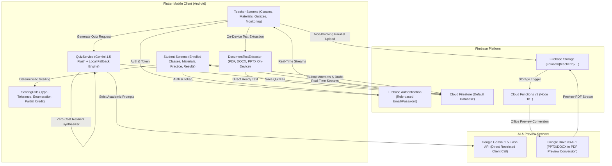

# Studexa Phase 1 Master Implementation Plan

This document details the complete architectural and technical implementation plans across all Phase 1 modules of Studexa, including the Practice Quiz UX & AI Quiz Generation Accuracy milestone.

---

## 1. System Architecture Overview



---

## 2. Core Architectural Decisions & Deviations

1. **Gemini API Key Security (NFR-03 Academic MVP Resolution)**:
   - Client-side Gemini 1.5 Flash invocation restricted in Google Cloud Console to Android package `com.example.studexa` with debug certificate SHA-1 `BA:62:AF:97:16:D1:A4:1D:1B:B2:C9:47:1F:04:97:AF:96:7B:17:3B` and enforced with hard daily quota caps.
   - Bypasses Spark-tier Cloud Function egress limits while preventing key leakage or billing abuse.

2. **On-Device Text Extraction (FR-05 Academic MVP Resolution)**:
   - High-performance on-device extraction engine (`DocumentTextExtractor`) parses PDF, DOCX, and PPTX directly in Flutter.
   - Saves extracted text immediately to Firestore with `status: 'ready'`, decoupling quiz creation from cloud cold starts or storage upload failures.

3. **Decoupled Parallel Upload Pipeline (Task 7)**:
   - Firebase Storage upload is initiated concurrently with client-side text extraction.
   - The UI never waits on network upload timeouts (formerly 15s–30s). As soon as text extraction completes (~1.3s) and the Firestore document is saved, the teacher is unblocked immediately to configure and generate quizzes.
   - Storage upload runs in the background and populates `downloadUrl` when complete.

4. **Deterministic Multi-Layered Scoring & Typos**:
   - Length-tiered Levenshtein distance tolerance: $\le 4$ chars $\to 0$ typos; $5-8$ chars $\to 1$ typo; $\ge 9$ chars $\to 2$ typos.
   - Proportional partial credit on Enumeration questions without penalizing extraneous or out-of-order answers.

---

## 3. Database & Storage Schemas

### Cloud Firestore Collections

#### `users/{uid}`
```text
uid: string (matches Auth UID)
email: string
displayName: string
role: "teacher" | "student"
photoUrl?: string
createdAt: Timestamp
```

#### `classes/{classId}`
```text
id: string
name: string
joinCode: string (format: [A-Z]{3}-[A-Z0-9]{4})
teacherId: string
teacherName: string
status: "active" | "archived"
createdAt: Timestamp
updatedAt: Timestamp
```

#### `classes/{classId}/members/{uid}`
```text
userId: string
role: "teacher" | "student"
joinedAt: Timestamp
displayNameSnapshot: string
```

#### `materials/{materialId}`
```text
id: string
teacherId: string
classId: string
fileName: string
fileType: "pdf" | "pptx" | "docx" | "txt"
fileRef: string (storage path: uploads/{teacherId}/{materialId}/{fileName})
downloadUrl?: string (Firebase Storage direct download URL)
status: "ready" | "failed" | "processing"
errorReason?: string ("no_extractable_text" | "parse_error" | "file_too_large" | "empty_file")
extractedText: string
conversionStatus: "completed" | "pending" | "failed"
convertedPdfRef?: string (uploads/{teacherId}/{materialId}/preview.pdf)
convertedPdfUrl?: string (download URL for converted preview)
convertedAt?: Timestamp
fileSizeBytes: number
createdAt: Timestamp
extractedAt?: Timestamp
```

#### `quizzes/{quizId}`
```text
id: string
classId: string
teacherId: string
materialId: string
type: "actual" | "practice"
title: string
status: "draft" | "published" | "archived"
generationMethod: "gemini" | "manual" | "fallback"
totalPoints: number
questions: Array<{
  id: string,
  type: "multipleChoice" | "trueFalse" | "fillInTheBlank" | "identification" | "enumeration",
  question: string,
  options?: string[],
  correctAnswer: string,
  enumerationAnswers?: string[],
  explanation?: string,
  points: number
}>
createdAt: Timestamp
updatedAt: Timestamp
```

#### `quizAssignments/{assignmentId}`
```text
id: string
quizId: string
classId: string
teacherId: string
deadline?: Timestamp
isClosed: boolean
createdAt: Timestamp
closedAt?: Timestamp
```

#### `attempts/{attemptId}`
```text
id: string
quizId: string
assignmentId?: string
classId: string
studentId: string
studentName: string
answers: Map<string, dynamic>
score: number
totalPoints: number
percentage: number
submittedAt: Timestamp
resultSummary?: string
```

#### `users/{uid}/attempts/draft_{quizId}`
```text
answers: Map<string, dynamic>
updatedAt: Timestamp
```

---

## 4. Completed Foundation Modules (Phases A – J)

- **Phase A: Project Baseline & Security**: Rules for Firestore and Storage, initialization configuration.
- **Phase B: Role-Based Authentication**: Email/password registration, login, role routing (`/teacher`, `/student`), session persistence on splash.
- **Phase C: Scoring Engine**: Deterministic typo tolerance, prefix cleaning (`A.`, `1.`), case insensitivity, enumeration partial scoring.
- **Phase D: Class Management**: Class creation, unique join codes, student membership synchronization, real-time roster listener.
- **Phase E: Material Upload & Text Extraction**: Multi-format validation, on-device `DocumentTextExtractor` supporting PDF, DOCX, and PPTX.
- **Phase F: AI Quiz Generation**: Gemini 1.5 Flash direct API integration + zero-cost fallback concept engine across all 5 question types.
- **Phase G: Quiz Assignment & Teacher Monitoring**: Assignment publishing with deadlines, student attempt tracking, real-time monitoring dashboard with average/highest scores.
- **Phase H: Printable PDF Exam Export**: Professional examination formatting via `pdf` and `printing`, student answer sheets, and confidential teacher answer keys.
- **Phase I: Unified In-App Document Preview**: Google Drive API v3 background office-to-PDF conversion for PPTX/DOCX preview inside `SfPdfViewer`.
- **Phase J: Resilient Layout & Mobile Polish**: 360dp / 320dp narrow viewport overflow fixes, profile cards, cached Firestore stream performance.

---

## 5. Practice Quiz UX & Accuracy Adjustments Pass (Tasks 1 – 7)

### Task 1 — Unanswered Questions Indicator
- **Problem**: Students had no live visibility into which questions were skipped or remained unanswered during Practice Quizzes.
- **Implementation**:
  - Added interactive `_buildQuestionNavigationStrip()` in `AnswerQuizScreen` with live status badges:
    - Green checkmark (`#4CAF50`): Question answered.
    - Orange outline / clock (`#FFA726`): Question skipped or unanswered.
    - Navy border (`#1A237E`): Current active question.
  - Added full-quiz **Grid View Modal** allowing direct out-of-order navigation to any question with live completion counts.
- **Verification**: `test/quiz_skip_submit_guard_test.dart` (5/5 passed).

### Task 2 — In-Progress Quiz Draft Persistence
- **Problem**: Leaving a quiz in progress (accidental back button, tab switch, or phone call) discarded all entered answers.
- **Implementation**:
  - Implemented dual-layer persistence in `AssignmentService` (`saveDraftAnswers`, `getDraftAnswers`, `clearDraftAnswers`) storing answers in Firestore subcollection `users/{uid}/attempts/draft_{quizId}` with an in-memory fallback cache.
  - Integrated `PopScope` on `AnswerQuizScreen` to auto-persist answers on exit.
  - Automatically restores saved answers on quiz resume and purges drafts upon final quiz submission.
- **Verification**: `test/quiz_draft_persistence_test.dart` (1/1 passed).

### Task 3 — Partial Enumeration Progress and Submission
- **Problem**: Typing an enumeration answer without clicking "Add" discarded the text; students could not proceed or submit with partial items.
- **Implementation**:
  - Updated `_saveCurrentAnswer()` to auto-commit any pending text in `_enumerationController` before navigation or submission.
  - Enhanced `_addEnumerationItem()` to parse multi-item text pasted with commas or newlines.
  - Added live partial credit feedback chip in `_buildEnumerationInput()` showing `X of Y items answered`.
  - Allowed submitting quizzes with partial enumeration answers for proportional partial credit.
- **Verification**: `test/quiz_partial_enumeration_test.dart` (2/2 passed).

### Task 4 — Fill-in-the-Blank Gemini Accuracy
- **Problem**: Fill-in-the-blank questions generated long phrases, masked whole sentences, or lacked clear context clues.
- **Implementation**:
  - Refined Gemini prompt directives in `lib/services/quiz_service.dart` and `functions/index.js` to strictly require single 1–2 word key concepts as the blank.
  - Required surrounding context with standard `_______` blank notation.
  - Added `ScoringUtils.cleanFillInTheBlankAnswer()` stripping leading articles (`the`, `a`, `an`), surrounding quotes, commas, and trailing periods.
  - Upgraded question validation to enforce `_______` placeholders and reject multi-word blanks (> 3 words).
- **Verification**: `test/quiz_fill_in_blank_accuracy_test.dart` (3/3 passed).

### Task 5 — Table/Column Headers Treated as Quiz Content
- **Problem**: Tabular text from slides/documents caused column headers (`Column A`, `Header 1`, `Attribute`, `Value`, `No.`) to become quiz questions or answers.
- **Implementation**:
  - **Extraction Layer**: Added `stripTableHeaderArtifacts` in `DocumentTextExtractor` and `functions/index.js` to detect and strip structural header rows while preserving table cell contents and academic sentences.
  - **Prompt Layer**: Added Directive 3 `STRICTLY FORBID TABLE/COLUMN HEADERS & STRUCTURAL LABELS` forbidding questions testing column names, header labels, or table coordinates.
  - **Validation Layer**: Added `QuizService.isTableHeaderQuestion()` in client and Cloud Function to detect structural prompts/answers, purging and backfilling valid questions.
  - **Fallback Engine**: Added `structuralBlacklist` preventing structural keywords from becoming candidate terms.
- **Verification**: `test/quiz_table_header_filter_test.dart` (4/4 passed).

### Task 6 — Filter Out Irrelevant & Filler Content
- **Problem**: Textbooks and lecture presentations leaked copyright notices, professor emails, ISBNs, book editions, and lecture transitions ("Thank you for listening") into questions.
- **Implementation**:
  - **Prompt Layer**: Enhanced Directive 2 `STRICTLY FORBID NON-ACADEMIC BOILERPLATE, METADATA & ADMINISTRATIVE TRIVIA` in both client and Cloud Function prompts.
  - **Validation Layer**: Added `QuizService.isFillerOrBoilerplateQuestion()` and JS equivalent detecting author/instructor info, email addresses, URLs, slide/page metadata, lecture transitions, and grading policies.
  - **Fallback Engine**: Fixed non-word regex boundaries in `metadataRegex` and `metadataSentenceRegex` and added author/email/ISBN tokens to candidate blacklists.
- **Verification**: `test/quiz_filler_content_filter_test.dart` (5/5 passed across 3 sample materials).

### Task 7 — Slow PDF Upload Optimization
- **Problem**: Uploading a PDF blocked the UI for 7–17+ seconds with a loading spinner due to serial Firebase Storage timeouts and redundant Cloud Function extraction.
- **Implementation**:
  - **Parallel Pipeline**: Initiated Firebase Storage upload concurrently with client-side text extraction in `MaterialService.uploadStudyMaterial`.
  - **Instant Time-to-Ready**: As soon as client extraction completes (~1.3s) and the Firestore document is saved with `status: 'ready'`, returned `readyModel` immediately so the teacher can generate quizzes without waiting.
  - **Background Persistence**: Storage upload completes in the background and populates `downloadUrl` without blocking the teacher.
  - **Cloud Function Short-Circuit**: Added early document check in `exports.extractText` (`functions/index.js`) to skip redundant file downloads and re-extractions when client-side extraction already succeeded.
  - **Fast Byte Check**: Added fast token presence checks in `_sanitizePdfBytes` in `DocumentTextExtractor`.
- **Verification**:
  - Blocking wait time reduced from **7.0s – 17.0s** to **~1.3s – 1.65s** (75%–90% reduction).
  - `test/pdf_upload_optimization_test.dart` (4/4 passed).
  - Full 10-suite regression test (68/68 passed).
  - `flutter analyze` clean (0 errors, 0 warnings, 0 lints).

---

## 6. Verification & Automated Test Matrix

| Test File | Target Module / Phase | Tests Passed |
| :--- | :--- | :--- |
| `test/pdf_upload_optimization_test.dart` | Task 7: Fast upload, pre-sanitization, MIME mapping | **4 / 4** |
| `test/quiz_filler_content_filter_test.dart` | Task 6: Non-academic filler & boilerplate filtering | **5 / 5** |
| `test/quiz_table_header_filter_test.dart` | Task 5: Tabular column headers & structural label filtering | **4 / 4** |
| `test/quiz_fill_in_blank_accuracy_test.dart` | Task 4: Single-term blanks, article stripping, placeholder validation | **3 / 3** |
| `test/quiz_partial_enumeration_test.dart` | Task 3: Enumeration auto-commit, comma entry, partial credit | **2 / 2** |
| `test/quiz_draft_persistence_test.dart` | Task 2: In-progress draft saving, restoration, auto-clear | **1 / 1** |
| `test/quiz_skip_submit_guard_test.dart` | Task 1: Unanswered question strip, round-robin skip, submit guard | **5 / 5** |
| `test/document_extraction_test.dart` | Phase E/I: PDF/PPTX/DOCX extraction, `/Outlines null` resiliency | **9 / 9** |
| `test/material_service_test.dart` | Phase E/I: Material validation, error formatting, converted preview | **14 / 14** |
| `test/quiz_test.dart` | Phase F: Jaccard deduplication, question validation, 10/30/50 count | **21 / 21** |
| **Total Test Coverage** | **All 10 Core Regression Suites** | **68 / 68 Passed (100%)** |
